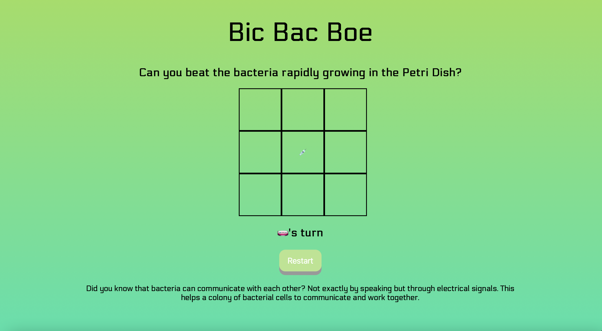

# bicbacboe
A bacterial takeover on the classic Tic Tac Toe game! This project was created using a blend of HTML, CSS and js. 
From creating this game, I got to learn more about the DOM and how js can alter HTML attirbutes or CSS styles depending on the functions built in js. 

I hope you learn some new facts about bacteria while playing the game!

# What I Learned 
  * Learned about “this” keyword which refers to an object in the local scope and moves up to the global scope if it is placed in the window object 
  * Practiced using “.addEventListener”, “.querySelector”, & “.getElementByID/class”
  * Worked on creating arrow functions 
  * Nested multiple conditional statements in a function 
  
# Preview

# Demo
🕹 [Bic Bac Boe](https://bubblegumloco.github.io/bicbacboe/)

